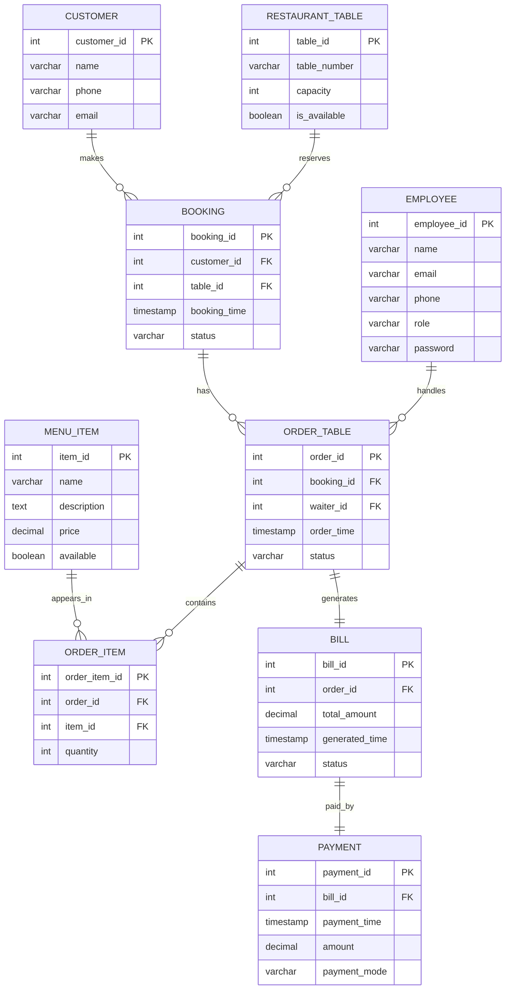
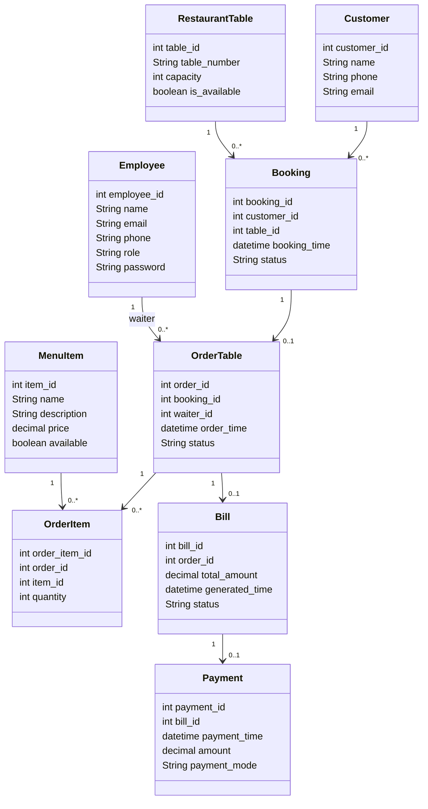
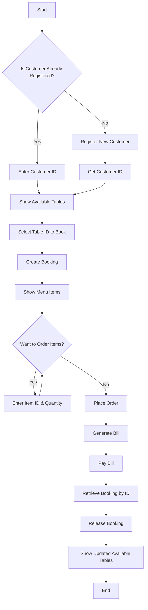
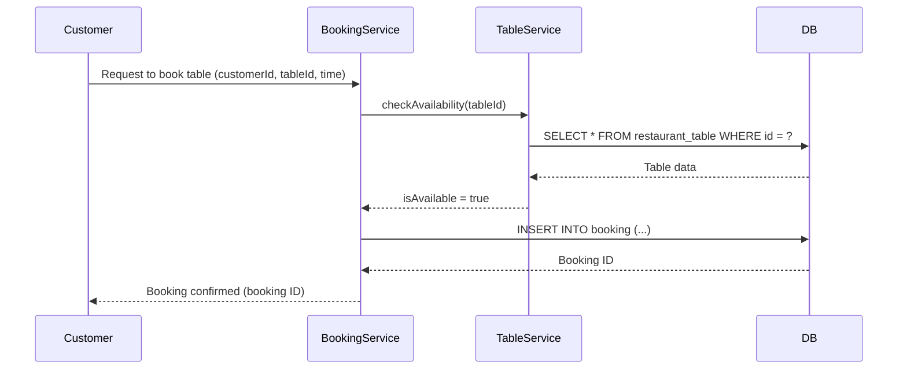
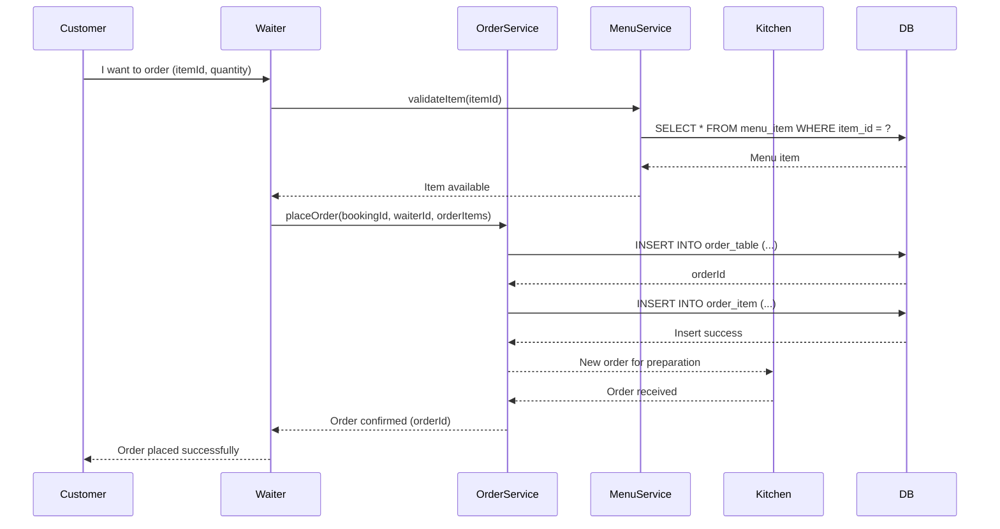
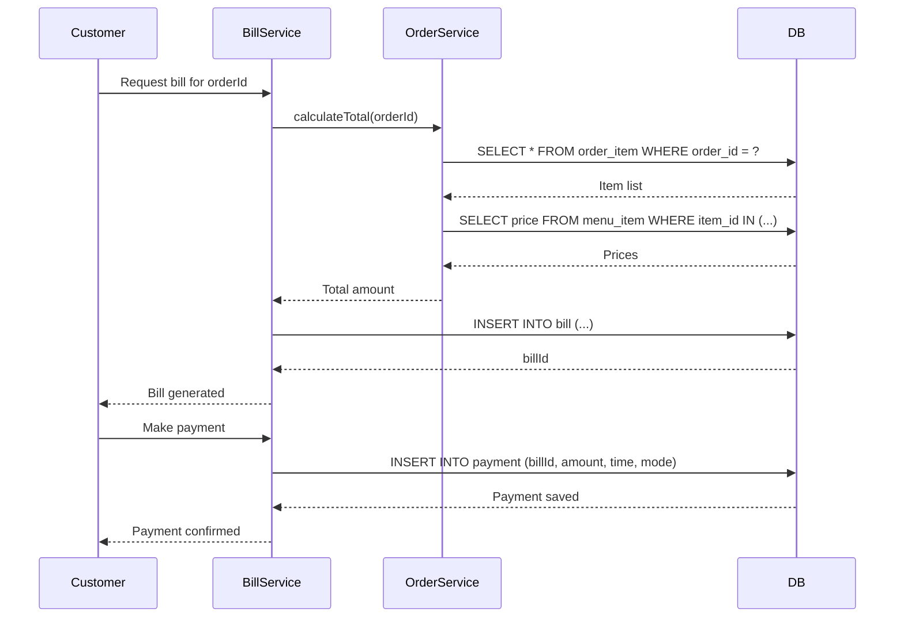

# Restaurant Management System

A comprehensive Java-based restaurant management system that handles table bookings, customer management, menu items, orders, and billing.

## Features

- **Customer Management**: Register new customers and maintain customer profiles
- **Table Booking**: Manage table reservations and availability
- **Menu Management**: Create and maintain menu items with descriptions and prices
- **Order Processing**: Take and track customer orders 
- **Billing System**: Generate and manage bills for customer orders
- **Payment Processing**: Handle various payment methods
- **Employee Management**: Track employee information and roles

## System Requirements

- Java Development Kit (JDK) 17 or higher
- PostgreSQL Database
- Maven for dependency management

## Project Setup

### Database Configuration

1. Install PostgreSQL if not already installed
2. Create a new database for the restaurant management system
3. Configure your database connection in `src/main/resources/application.properties`:

```properties
db.url=jdbc:postgresql://localhost:5432/your_database_name
db.user=your_username
db.password=your_password
```

### Building the Project

```bash
# Clone the repository 
git clone https://github.com/Imrancr7/Upgrad_Restaurant_Management.git
cd restaurant-management

# Build with Maven
mvn clean package
```

### Running the Application

```bash

java -jar target/restaurant-management-1.0-SNAPSHOT.jar
```

## Project Structure

- **config/**: Contains database configuration
- **enums/**: Enumeration classes used throughout the project
- **model/**: Data models representing core entities (Customer, Booking, MenuItem, etc.)
- **repo/**: Data Access Objects (DAOs) for database operations
  - **DAOImpl/**: Implementation of DAO interfaces
  - **DAOInterface/**: Interfaces defining data access operations
- **service/**: Business logic for different functionalities
  - **Admin/**: Admin-specific operations
  - **Bill/**: Billing operations
  - **Booking/**: Table reservation operations
  - **Customer/**: Customer management operations
  - **Menu/**: Menu management operations
  - **Order/**: Order processing operations
- **diagrams/**: PlantUML diagrams for system architecture visualization

## Design Patterns Used

- **Builder Pattern**: Used in model classes to create immutable objects with many optional parameters
- **DAO Pattern**: Separates persistence logic from business logic
- **Service Layer Pattern**: Encapsulates business logic separate from controllers and data access

## Database Schema

The system uses a relational database with the following main tables:
- Customers
- Bookings
- RestaurantTables
- MenuItems
- OrderItems
- OrderTables
- Bills
- Payments
- Employees

# ER Diagram


# Class Diagram

# Flow Diagram


# Table Booking - Sequence Diagram

# Order Placement Flow - Sequence Diagram

# Bill Generation Flow - Sequence Diagram


